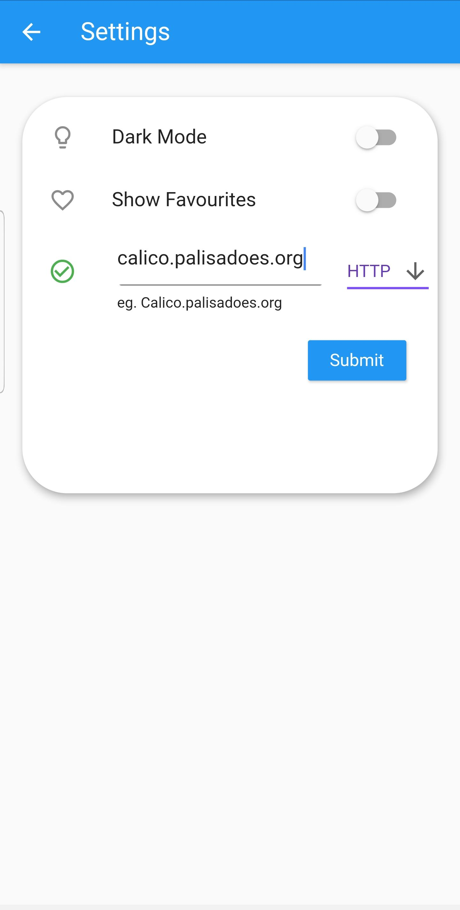
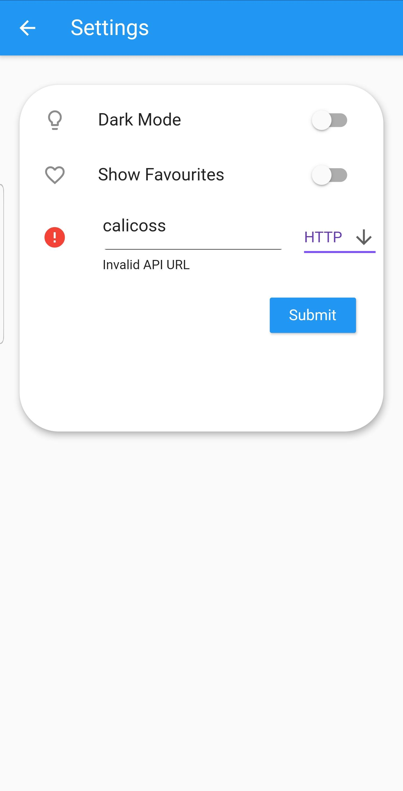

Acessing Agents
==================

.. image:: images/AgentsScreen.jpeg
  :width: 400
  

It is now time time to select the source. 
Click the hamburger menu in the uper right corner to access the settings screen.

.. image:: images/Settings.jpeg
  :width: 400
  
You will be greeted with 3 options,
- Activate Dark Mode
- Show Favorites
- Select Data source.

In the select data source, you will see a sample source. 
Erase the data and enter the valid source you wish to use. 

When done correctly, your screen should look like this:

  
  
If after entering the data teh screen looks like this:

clear the source field and try again. 
