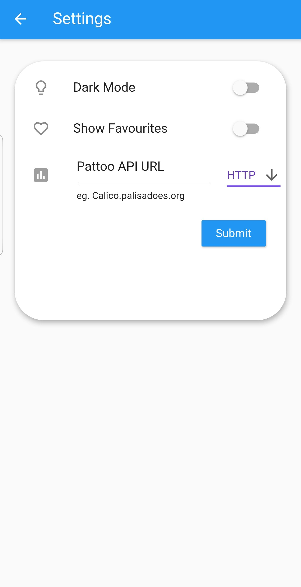
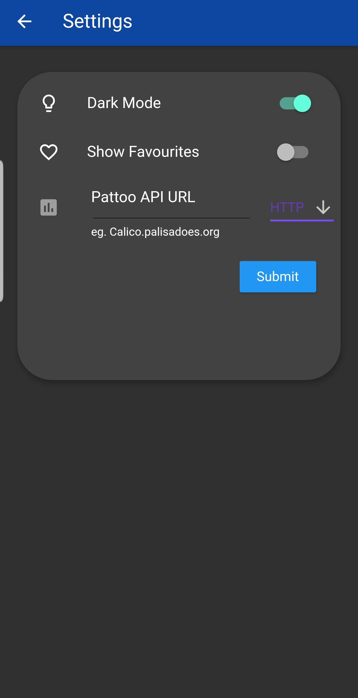

Activating Dark Mode
==========================

The user has the option to activate dark mode on the application.
Click the hamburger menu in the uper right corner to access the settings screen.

  
You will be greeted with 3 options,
- Activate Dark Mode
- Show Favorites
- Select Data source.

To activate dark mode, click the dark mode switch. 
The results should nbe immediate. 

