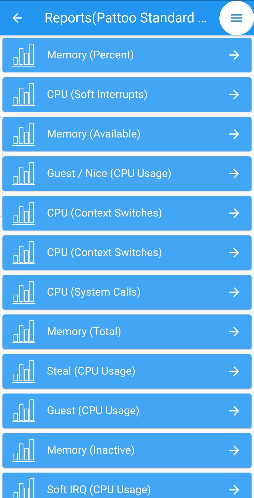

How To View Reports
==================

Once the correct data is entered in the souce field, and a source is selected, 
You shoudl see the list of reports displayed on the screen as seen bellow.

To see the charts in more detail, select the tile of interest. 

Upon selecting the tile, you should see the time series data chart. 
